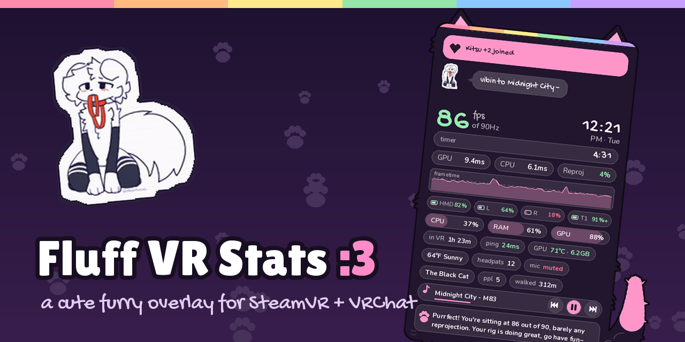
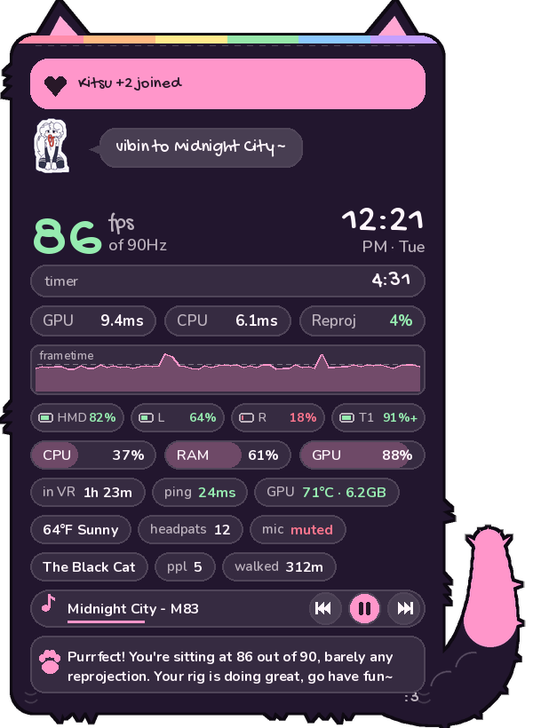
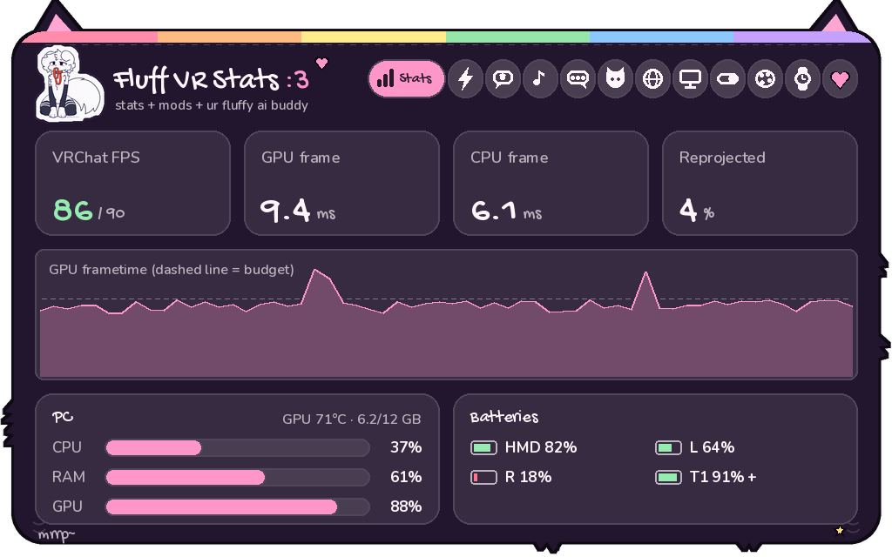
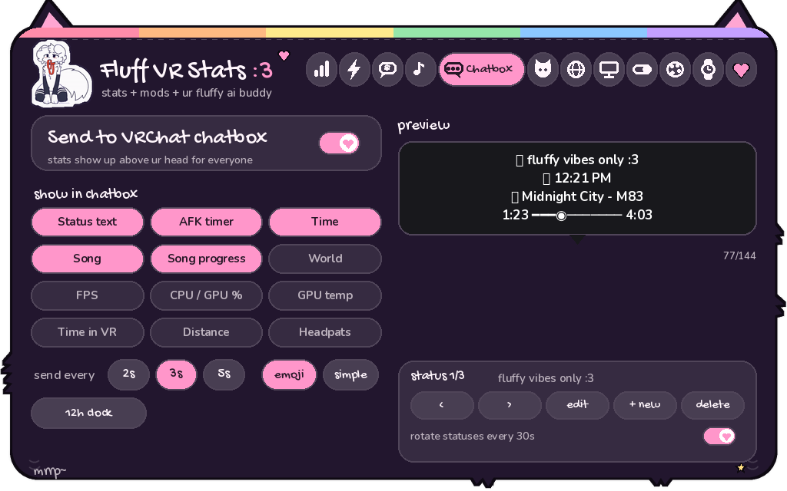
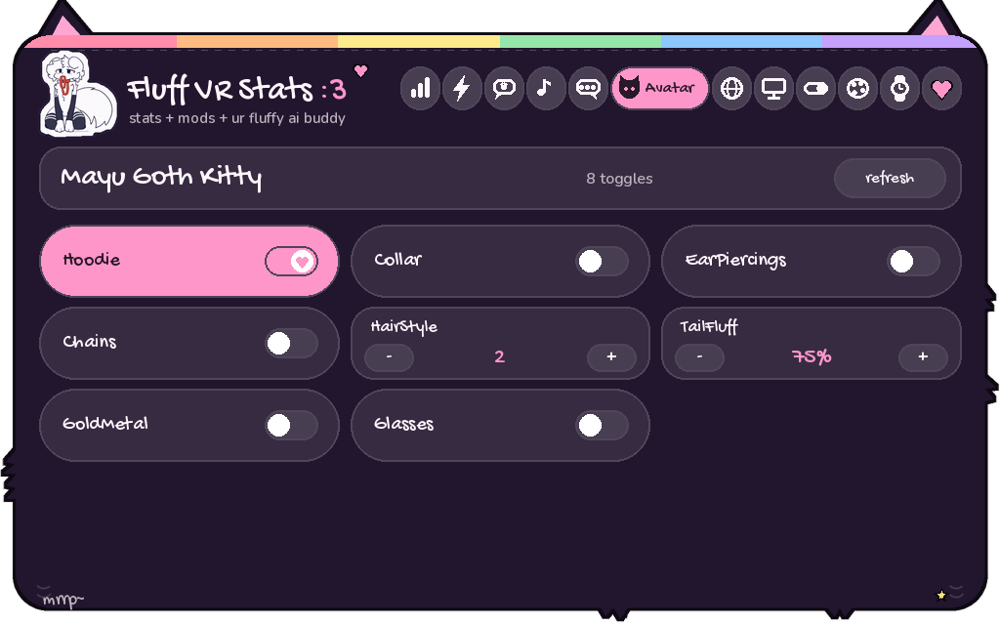
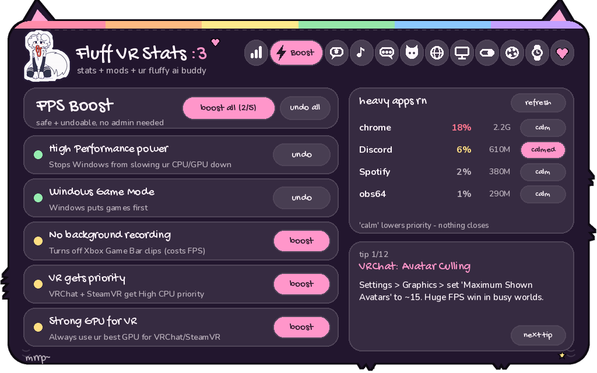

<p align="center">
  
</p>

<p align="center">
  <b>a cute, furry, open source overlay for SteamVR + VRChat</b><br>
  stats on ur wrist · an AI buddy · music controls · chatbox stats · avatar toggles · FPS boost
</p>

<p align="center">
  <a href="https://github.com/wolfiecodesowo/fluff-vr-stats/releases/latest"><b>⬇ Download</b></a> ·
  <a href="https://wolfiecodesowo.github.io/fluff-vr-stats/">Website</a> ·
  <a href="docs/trailer.mp4">Trailer</a> ·
  <a href="https://github.com/wolfiecodesowo/fluff-vr-stats/issues">Report a bug</a>
</p>

---

Fluff VR Stats runs as its own little app next to VRChat. It **never touches VRChat's files**: no mods, no injection, so it's safe with EAC. Everything shows up inside SteamVR: a fluffy HUD on your wrist and a full menu in your SteamVR dashboard.

## ✨ Features



**On your wrist** (it fades in when you look at it)
- VRChat FPS, GPU/CPU frame times, reprojection, frametime graph
- headset / controller / tracker batteries, CPU / RAM / GPU load
- **music controls you tap with your other hand**
- **Lil Fluff pet** with moods:
  - sleeps when you're AFK
  - vibes to your music
  - panics at low FPS
- join/leave alerts, timer, zoomies meter, clock

**In your SteamVR dashboard: 12 tabs**

| | |
|---|---|
| 📊 **Stats** | everything about your performance |
| ⚡ **Boost** | safe, one-tap FPS tweaks: power plan, Game Mode, no background recording, VR priority, best GPU. All undoable. |
| 💬 **Chat** | talk to **Fluff**, your AI buddy (free with Groq) |
| 🎵 **Music** | album art + controls for Spotify, YouTube, anything |
| 🗨️ **Chatbox** | MagicChatbox-style stats in the VRChat chatbox, with a live preview |
| 🐱 **Avatar** | your avatar's toggles as buttons, read straight from VRChat's OSC files |
| 🌍 **World** | world, instance, who's here, timer, today's recap |
| 🖥️ **Screen** | your desktop floating in VR |
| 🧩 **Mods** | 33 toggles |
| 🎨 **Style** | 25 themes · 12 accents · 9 backgrounds · 7 ear styles |
| ⌚ **Wrist** | move / tilt / resize the wrist HUD |
| 💖 **<3** | a thank-you page with a floof you can pat |

<p align="center">
   
   
</p>

**And it's cute everywhere:**
- hand-drawn fur panels with ears and a tail
- a paw-print laser cursor
- a startup intro + sound
- and when something breaks, a derpy error cat instead of a crash


## 💾 Install (Windows)
1. Install **Python 3.10+** from [python.org](https://www.python.org/downloads/). Tick **"Add python.exe to PATH"**.
2. Download the latest **[release zip](https://github.com/wolfiecodesowo/fluff-vr-stats/releases/latest)** and unzip it anywhere.
3. Double-click **`install.bat`**.
4. *(optional)* Double-click **`setup_ai.bat`** to give Fluff a brain. Groq is free.
5. Double-click **`run.bat`**. It waits for SteamVR if SteamVR isn't open yet.
6. *(optional)* Run `python autostart_with_steamvr.py` once to start it with SteamVR every time.

**VRChat features** (chatbox, avatar toggles, mute, headpats) need OSC: in VRChat, go to Action Menu → Options → OSC → **Enabled**.
- Close MagicChatbox while using the chatbox tab, or they'll fight over the chatbox.

## 💜 Discord
- **Discord status:** while the app runs, your Discord profile shows *"Fluff VR Stats :3 · 90 fps in The Black Cat"* with Download / Join buttons. Just keep the Discord app open. Toggle it in Mods → Fun.
- **Fluff Bot** (`bot/`): the official server bot.
  - `/setup` builds the whole server: roles, channels, staff-only info channels, role buttons and all the info posts.
  - It gives anyone running the app the **🥽 In VR Now** role and keeps a live counter.
  - It welcomes people, logs to #mod-log, blocks invite spam and auto-posts GitHub releases.
  - **45 slash commands:** client guides (`/download`, `/install`, `/mods`, `/boost`...), `/ticket` private support, `/suggest` + `/bug` with voting threads, `/invr`, fun ones (`/headpat`, `/boop`, `/fluffrate`, `/8ball`) and staff tools (`/poll`, `/warn`, `/timeout`, `/lockdown`).
  - To run your own: `bot/setup_bot.bat` (paste your bot token), then `bot/run_bot.bat`. Edit `bot/content.py` to change the channels and posts.

## 🔒 Privacy
- Everything runs on your PC.
- The only things that go online:
  - AI chat, sent to the provider you picked
  - Discord status, sent to your local Discord app (turn off in Mods)
  - weather, if you turn it on
  - ping, if you turn it on
- World and player info comes from VRChat's own log file on your PC.
- Your settings and API key stay in `config.json`, which is git-ignored and never shared.

## 🛠️ For developers
```
python preview.py        # renders every screen to PNGs, no headset needed
python tools/make_sound.py   # rebuild the startup sound
```
- **Code map:** `main.py` (app + VR), `ui.py` (all drawing), `themes.py`, `stats.py`, `music.py`, `chatbox.py`, `vrclog.py`, `avatar.py`, `tweaks.py`, `discord_link.py` (Discord status), `gltex.py` (flicker-free GPU textures), `bot/` (Fluff Bot).
- **New theme:** add one line to `PRESETS` in `themes.py`.
- **New mod:** add it to `MOD_INFO` in `ui.py` and `DEFAULT_CFG["modules"]` in `main.py`.

PRs welcome!! Please keep it cute :3

## 💖 Credits
- Made by **[wolfiecodesowo](https://github.com/wolfiecodesowo)** with love for the fluffy community.
- Sticker art © the original artists. It isn't covered by the code license; see [ASSETS.md](ASSETS.md).
- Fonts: Fredoka, Nunito, Gochi Hand, Lilita One (SIL OFL) and DejaVu Sans.

**License:** code is [MIT](LICENSE).
